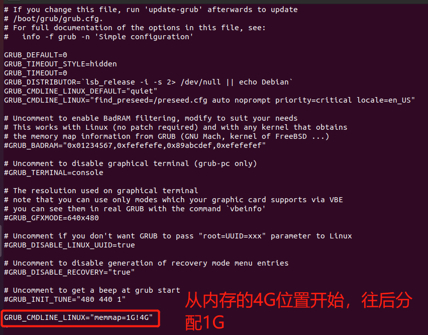
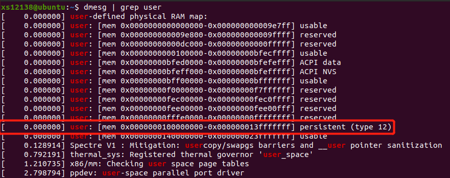
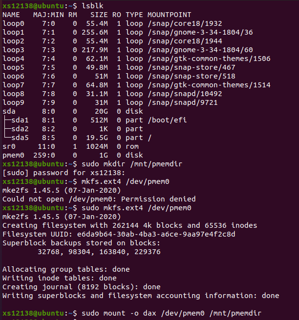
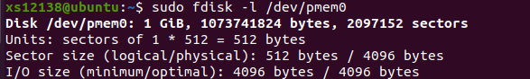
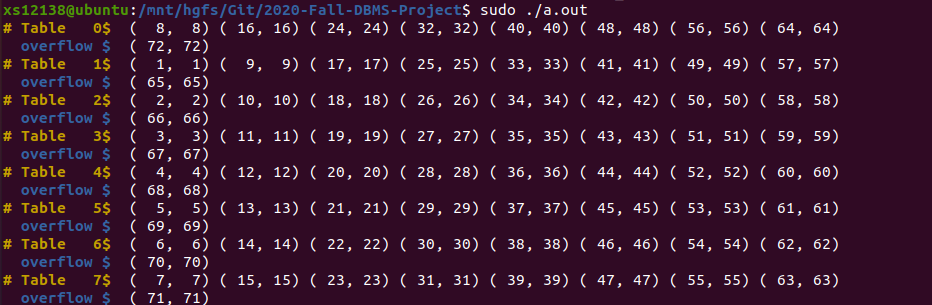
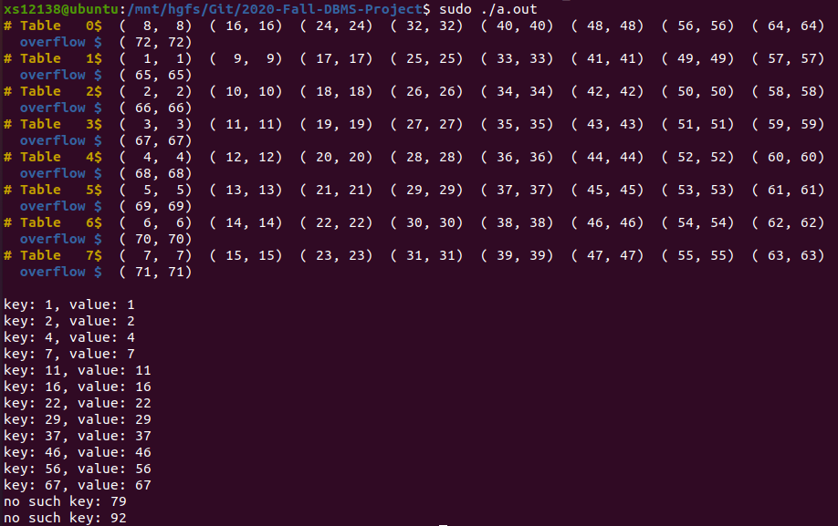
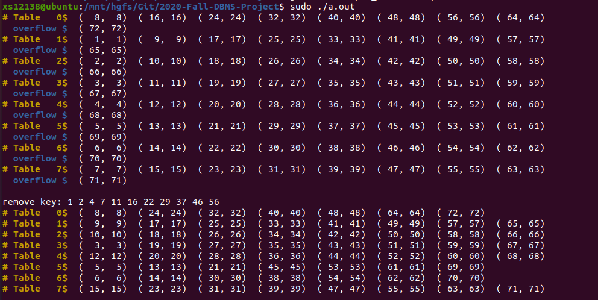
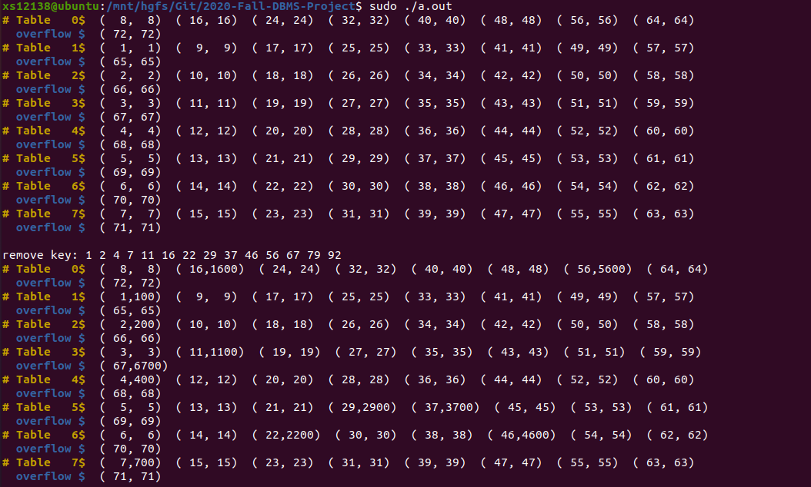

# 2020年秋季学期数据库课程设计

name|student_id|Github_nickname|e-mail|
:-:|:-:|:-:|:-:|
蔡桂鸿|18341001|gmWMpInYgY|1064975761@qq.com
岑鉴焕|18341002|12138xs/Cenjh12138|935440918@qq.com
张一准|18339025|zhangyzh59|zhangyzh59@163.com

## Github地址
&nbsp;&nbsp;&nbsp;&nbsp;&nbsp;&nbsp;&nbsp;&nbsp;https://github.com/12138xs/2020-Fall-DBMS-Project

## 目录
- [2020年秋季学期数据库课程设计](#2020年秋季学期数据库课程设计)
  - [Github地址](#github地址)
  - [目录](#目录)
  - [实验环境](#实验环境)
  - [实验工具](#实验工具)
  - [实验任务](#实验任务)
    - [一、利用普通内存模拟NVM环境并测试](#一利用普通内存模拟nvm环境并测试)
    - [二、PMDK库的介绍与安装](#二pmdk库的介绍与安装)
    - [三、线性哈希的具体实现](#三线性哈希的具体实现)
    - [四、利用benchmark测试及测试结果](#四利用benchmark测试及测试结果)
    - [五、溢出桶空间回收的实现](#五溢出桶空间回收的实现)
    - [六、关于多线程的思考](#六关于多线程的思考)


## 实验环境
* 硬件型号：Intel(R) Core(TM) i5-8250U CPU @ 1.60Ghz
* 平台版本：Ubuntu 20.04.1 LTS

## 实验工具
* gcc version 9.3.0
* GNU Make 4.2.1
* cmake version 3.16.3
* VS code

## 实验任务
### 一、利用普通内存模拟NVM环境并测试
&nbsp;&nbsp;&nbsp;&nbsp;&nbsp;&nbsp;&nbsp;&nbsp;根据Intel公司提供的[How to Emulate Persistent Memory Using Dynamic Random-access Memory](https://software.intel.com/content/www/us/en/develop/articles/how-to-emulate-persistent-memory-on-an-intel-architecture-server.html)教程，在linux系统内核的英特尔处理器上使用DRAM设置持久性内存仿真，由于**Ubuntu 20.04.1**是比较新的Linux发行版，因此可以直接从**GRUB Configuration**这一步开始配置具体步骤如下所示。

1. 在```/etc/default/grub```文件中配置环境，添加片段```GRUB_CMDLINE_LINUX="memmap=nn[KMG]!ss[KMG]"```。下图为配置的文件示例。


2. 配置成功之后，需要更新配置和设置配置(以root身份运行)，使用到以下两个命令。
```bash
    update-grub
    grub-mkconfig -o /boot/grub/grub.cfg
```

&nbsp;&nbsp;&nbsp;&nbsp;&nbsp;&nbsp;&nbsp;&nbsp;运行```dmesg | grep user```检测配置结果，结果如下图所示。



3. 建立直接访问的文件系统，使用以下三个命令。
```bash
    mkdir /mnt/pmemdir
    mkfs.ext4 /dev/pmem3
    mount -o dax /dev/pmem3 /mnt/pmemdir
    sudo fdisk -l /dev/pmem0
```

&nbsp;&nbsp;&nbsp;&nbsp;&nbsp;&nbsp;&nbsp;&nbsp;配置过程截图如下所示。





### 二、PMDK库的介绍与安装

&nbsp;&nbsp;&nbsp;&nbsp;&nbsp;&nbsp;&nbsp;&nbsp;**PMDK**(**Persistent Memory Development Kit**)是Intel公司为了方便设计非易失性内存的应用而开发的函数库和工具包。本次实验主要使用**PMDK**中```libpmem```库中的三个函数。
```cpp
pmem_map()      //将目标文件通过内存映射的方式打开并返回文件的虚拟地址
pmem_persist()  //显示持久化相应的数据，修改数据库的数据项之后都需要调用该函数
pmem_unmap()    //用于关闭通过pmem_map()打开的文件
```
&nbsp;&nbsp;&nbsp;&nbsp;&nbsp;&nbsp;&nbsp;&nbsp;安装方法主要参考PMDK的[GitHub](https://github.com/pmem/pmdk)，具体安装过程如下所示。

1. 安装依赖软件
```bash
sudo apt-get install autoconf
sudo apt-get install pkg-config
sudo apt-get install libndctl-dev   //默认安装版本为v61
sudo apt-get install libdaxctl-dev  //默认安装版本为v61
sudo apt-get install pandoc
sudo apt-get install libfabric
```

2. libndctl-dev和libdaxctl-dev的版本需要大于v63，因此还需要对两个进行升级
```bash
sudo apt-get update
sudo apt-get upgrade libndctl-dev
sudo apt-get upgrade libdaxctl-dev
```

3. 执行make test和make check(以 root 身份运行)
```bash
cd ./pmdk
make test
make check
```
&nbsp;&nbsp;&nbsp;&nbsp;&nbsp;&nbsp;&nbsp;&nbsp;`make check`执行过程中会出现输出很多PASS，如果出现错误，请检查依赖软件是否安装成功，是否版本正确。


1. 编译源代码(以 root 身份进行)
```bash
make
 ```

5. 安装pmdk库(以 root 身份运行)
```bash
make install
 ```

6. 通过以下代码判断是否安装成功
```cpp
#include <sys/types.h>
#include <sys/stat.h>
#include <fcntl.h>
#include <stdio.h>
#include <errono.h>
#include <stdlib.h>
#include <string.h>
#include <libpmem.h>

#define PMEM_LEN 4*1024
#define PATH "mnt/pmemdir/pmem.001"

int main(int argc, char* argv[])
{
    char* pmemaddr;
    size_t mapped_len;
    int is_pmem;

    /* create a 4k pmem file and memory map it */
    if ((pmemaddr = pmem_map_file(PATH, PMEM_LEN, PMEM_FILE_CREATE,
			0666, &mapped_len, &is_pmem)) == NULL) {
		perror("pmem_map_file");
		exit(1);
	}

    /* store a string to the persistent memory */
    strcpy(pmemaddr, "hello, persistent memory");
    printf("is_pmem = %d\n", is_pmem);

    /* flush above strcpy to persistence */
    if (is_pmem)
        pmem_persist(pmemaddr, mapped_len);
    else
        pmem_msync(pmemaddr, mapped_len);

    /*
    * Delete the mappings. The region is also
    * automatically unmapped when the process is
    * terminated.
    */
    pmem_unmap(pmemaddr, mapped_len);
}
```
&nbsp;&nbsp;&nbsp;&nbsp;&nbsp;&nbsp;&nbsp;&nbsp;运行截图如下所示，可以看到变量`is_pmem`为1，表明 PMDK 库安装成功并且成功运行在非易失性内存上。
.png)


### 三、线性哈希的具体实现
&nbsp;&nbsp;&nbsp;&nbsp;&nbsp;&nbsp;&nbsp;&nbsp;本次课程设计主要实现线性哈希的插入(insert)、查询(search)、删除(remove)、更新(update)功能。

1. 文件路径及运行方式

&nbsp;&nbsp;&nbsp;&nbsp;&nbsp;&nbsp;&nbsp;&nbsp;在`main.cc`文件中有一个`FILE_PATH`的变量，其中路径`/mnt/pmemdir`是前面设置的搭载了 DAX 文件系统的 NVM 环境文件夹，其中创建的文件可用于实现非易失内存应用的设计。
```cpp
/*
* pmem file path
* NVM
* The folder with the file system ext4-dax mounted
*/
#define FILE_PATH "/mnt/pmemdir/pml_hash_file"
 ```

&nbsp;&nbsp;&nbsp;&nbsp;&nbsp;&nbsp;&nbsp;&nbsp;可以使用两种方法编译执行代码，第一种方式，使用 Cmake 自动化编译运行：
```bash
mkdir build
cd build
cp ../benchmark
cmake ..
make
sudo ./pmlhash
 ```

&nbsp;&nbsp;&nbsp;&nbsp;&nbsp;&nbsp;&nbsp;&nbsp;另一种方式是直接在代码文件路径下编译执行：
```bash
g++ main.cc pmlhash.cc -o pmlhash -lpmem
sudo ./pmlhash
 ```

2. 数据结构
```cpp
#define TABLE_INIT 4  // adjustable
#define TABLE_SIZE 32 // adjustable
#define HASH_SIZE  1024 // adjustable
#define FILE_SIZE 1024 * 1024 * 16  // 16 MB adjustable
#define BITSET_SIZE 1024 * 8        // 8 KB adjustable

typedef struct metadata {
    size_t size;            // the size of whole hash table array 
    size_t level;           // level of hash
    uint64_t next;          // the index of the next split hash table
    uint64_t overflow_num;  // amount of overflow hash tables 
} metadata;

// data entry of hash table
typedef struct entry {
    uint64_t key;
    uint64_t value;
} entry;

// hash table
typedef struct pm_table {
    entry kv_arr[TABLE_SIZE];   // data entry array of hash table
    uint64_t fill_num;          // amount of occupied slots in kv_arr
    uint64_t next_offset;       // the file address of overflow hash table 
} pm_table;

// persistent memory linear hash
class PMLHash {
private:
    void* start_addr;      // the start address of mapped file
    void* overflow_addr;   // the start address of overflow table array
    metadata* meta;        // virtual address of metadata
    pm_table* table_arr;   // virtual address of hash table array

    void split();
    uint64_t hashFunc(const uint64_t &key, const size_t &hash_size);
    pm_table* newOverflowTable(uint64_t &offset);       // find an available overflow table

public:
    PMLHash() = delete;
    PMLHash(const char* file_path);
    ~PMLHash();

    int insert(const uint64_t &key, const uint64_t &value);
    int search(const uint64_t &key, uint64_t &value);
    int remove(const uint64_t &key);
    int update(const uint64_t &key, const uint64_t &value);

    void display_table();       // dispaly the whole table, for test
};
```
* ```TABLE_INIT```是指线性哈希初始时桶的数量。
* ```TABLE_SIZE```是指每个桶可以容纳项的最大数量。
* ```HASH_SIZE```是指线性哈希容纳桶的最大数量。
* ```FILE_SIZE```申请空间的总大小。
* ```BITSET_SIZE```实现桶回收的 bitmap 空间大小。
* ```metadata```用来存储线性哈希相关的基础数据，包括哈希表的大小(size)、当前的循环级(level)、本次循环中下一个应当要分裂的桶的编号(next)、溢出桶的数量(overflow_num)。

* ```entry```是指桶中的每一项，包括了键值和数据值。

* ```pm_table```是指线性哈希中的桶，包括了 entry 数组(kv_arr)、当前桶中项的数量(fill_num)、假如该桶有溢出桶，则 next_offset 为溢出桶序号，如果没有则为-1。

* ```start_addr```是线性哈希的起始地址。

* ```overflow_addr```是线性哈希中溢出桶的起始地址。

* ```table_arr```是用来存储线性哈希桶的其实地址

3. 构造函数与析构函数的代码实现
```cpp
PMLHash::PMLHash(const char* file_path) {
    size_t mapped_len;
    int is_pmem;

    // get address
    if((start_addr = pmem_map_file(file_path, FILE_SIZE, PMEM_FILE_CREATE,
                0666, &mapped_len, &is_pmem)) == NULL) {
        perror("pmem_map_file");
        exit(1);
    }

    overflow_addr = (void *)((uint64_t)start_addr + (uint64_t)FILE_SIZE/2); 
    meta = (metadata*)start_addr;
    table_arr = (pm_table*)((uint64_t)meta + sizeof(metadata));
    is_used = (bool *)((uint64_t)overflow_addr - BITSET_SIZE);
    overflow_table_num = (FILE_SIZE/2)/(sizeof(pm_table));

    // initial data
    meta->size = TABLE_INIT;
    meta->level = 0;
    meta->next = 0;
    meta->overflow_num = 0;
    for(int i = 0; i < HASH_SIZE; i++){
        table_arr[i].fill_num = 0;
        table_arr[i].next_offset = -1;
        for(int j = 0; j < TABLE_SIZE; j++)
            table_arr[i].kv_arr[j].key = table_arr[i].kv_arr[j].value = -1; 
    }
    memset(is_used, 0, BITSET_SIZE);
}
 ```
&nbsp;&nbsp;&nbsp;&nbsp;&nbsp;&nbsp;&nbsp;&nbsp;构造函数中有三个地方值得注意
* 调用pmem_map_file()函数，该函数返回一个虚拟地址，可以实现在非易失性内存上运行。
```cpp
    if((start_addr = pmem_map_file(file_path, FILE_SIZE, PMEM_FILE_CREATE,
                0666, &mapped_len, &is_pmem)) == NULL) {
        perror("pmem_map_file");
        exit(1);
    }
    overflow_addr = (void *)((uint64_t)start_addr + (uint64_t)FILE_SIZE/2); 
 ```
&nbsp;&nbsp;&nbsp;&nbsp;&nbsp;&nbsp;&nbsp;&nbsp;overflow_addr变量指向申请空间的中间位置，将申请的空间划分为两部分。
* 变量is_used用来存储溢出桶是否为空，可以间接实现溢出桶空间回收
```cpp
    is_used = (bool*)((uint64_t)overflow_addr - (uint64_t)
 ```
* <a name="diag"></a>从start_addr开始之后的FILE_SIZE大小的空间中，其数据分布如下图所示
```
    | Metadata | Hash Table Array | is_used | Overflow Hash Tables |
    +----------------- 8 MB ----------------+------- 8 MB ---------+
 ```

4.  insert函数的实现

&nbsp;&nbsp;&nbsp;&nbsp;&nbsp;&nbsp;&nbsp;&nbsp;首先根据键值计算哈希值，之后根据哈希值定位对应的桶。定位桶时有以下三种可能性。
* 哈希值对应的桶正好未满，可以直接插入新添加的键值和数据
* 哈希值对应的桶已经满了，且其具有未填满的溢出桶，则可以插入到溢出桶中。根据线性哈希规则，此次插入会分裂```meta->next```对应的桶。
* 哈希值对应的桶和溢出桶都已经填满，则需要申请新的哈希桶，如果溢出空间已经满了，则输出**no enough overflow table for insert**。

&nbsp;&nbsp;&nbsp;&nbsp;&nbsp;&nbsp;&nbsp;&nbsp;insert函数的具体实现如下所示。
```cpp
int PMLHash::insert(const uint64_t &key, const uint64_t &value) {
    uint64_t h_key = hashFunc(key, meta->size);
    pm_table* table = (pm_table *)((uint64_t)start_addr + sizeof(metadata) + h_key * sizeof(pm_table));
    
    int split_flag = 0, i;     //check if the table is full
    while(table->fill_num == TABLE_SIZE){
        split_flag = 1;
        if(table->next_offset != -1){
            table = (pm_table *)((uint64_t)overflow_addr + table->next_offset);
        }else{
            for(i = 0; i < overflow_table_num; i++){
                if(is_used[i] != 1){
                    table->next_offset = (uint64_t)(i*sizeof(pm_table));
                    table = newOverflowTable(table->next_offset);
                    is_used[i] = 1;
                    break;
                }
            }
            if(i == overflow_table_num){
                printf("no enough overflow table for insert\n");
                return -1;
            }
        }
    }
    table->kv_arr[table->fill_num].key = key;
    table->kv_arr[table->fill_num].value = value;
    table->fill_num++;
    //if the table is full, split
    if(split_flag == 1)
        split();
    pmem_persist(start_addr,FILE_SIZE);
    return 0;
}
```
&nbsp;&nbsp;&nbsp;&nbsp;&nbsp;&nbsp;&nbsp;&nbsp;由于```insert```函数改变了线性哈希存储的内容，因此需要调用```pmem_persist```函数来显式持久化相应的数据。以下是insert函数的测试代码和测试结果截图。
```cpp
int main()
{
    PML_Hash hash(FILE_PATH);
    for(uint64_t i = 1;i <= (HASH_SIZE+1)*TABLE_SIZE;i++){
        hash.insert(i,i)
    }
    hash.display_table();
    return 0;
}
```


5. search函数的实现

&nbsp;&nbsp;&nbsp;&nbsp;&nbsp;&nbsp;&nbsp;&nbsp;search函数接受一个键值(key)和一个引用变量value，如果线性哈希中可以找到对应的key值，则返回0，并给value赋值；如果没有找到对应的key值，则返回-1，不给value赋值。该函数的具体实现如下所示。
```cpp
int PMLHash::search(const uint64_t &key, uint64_t &value) {
    uint64_t h_key = hashFunc(key, meta->size);
    pm_table* table = (pm_table *)((uint64_t)start_addr + sizeof(metadata) + h_key * sizeof(pm_table));
    
    while(true){
        for(int i = 0; i < table->fill_num; i++){
            if(table->kv_arr[i].key == key){
                value = table->kv_arr[i].value;
                return 0;
            }
        }
        if(table->next_offset == -1)    break;
        table = (pm_table*)((uint64_t)overflow_addr + table->next_offset);
    }
    return -1;
}
```
&nbsp;&nbsp;&nbsp;&nbsp;&nbsp;&nbsp;&nbsp;&nbsp;以下是search函数的测试代码和测试结果截图。

```cpp
int main()
{
    PML_Hash hash(FILE_PATH);
    for(uint64_t i = 1;i <= (HASH_SIZE+1)*TABLE_SIZE;i++){
        hash.insert(i,i)
    }
    hash.display_table();
    int ret = 0;
    for(uint64_t i = 1,j = 0;i <= (HASH_SIZE+5)*TABLE_SIZE;j++,i+=j){
        uint64_t val;
        ret = hash.search(i,val);
        if(!ret)
            cout << "key: " << i << ", value: " << val << endl;
        else
            cout << "no such key: " << i << endl;
    }
    return 0;
}
```


6. remove函数的实现

&nbsp;&nbsp;&nbsp;&nbsp;&nbsp;&nbsp;&nbsp;&nbsp;remove函数是比较关键的一个函数，在删除掉项之后，往往需要判断桶是否为空，如果为空，则需要进行同回收操作。remove函数的具体实现如下图所示。
```cpp
int PMLHash::remove(const uint64_t &key) {
    uint64_t h_key = hashFunc(key, meta->size);
    pm_table* table = (pm_table*)((uint64_t)start_addr + sizeof(metadata) + h_key * sizeof(pm_table));
    pm_table* last = table;

    while(true){
        for(int i = 0; i < table->fill_num; i++){
            if(table->kv_arr[i].key == key){
                for(int j = i; j < table->fill_num-1; j++){
                    table->kv_arr[j].key = table->kv_arr[j+1].key;
                    table->kv_arr[j].value = table->kv_arr[j+1].value;
                }
                while(table->next_offset != -1){
                    last = table;
                    table = (pm_table*)((uint64_t)overflow_addr + table->next_offset);
                    last->kv_arr[TABLE_SIZE-1].key = table->kv_arr[0].key;
                    last->kv_arr[TABLE_SIZE-1].value = table->kv_arr[0].value;
                    for(int j = 0; j < table->fill_num-1; j++){
                        table->kv_arr[j].key = table->kv_arr[j+1].key;
                        table->kv_arr[j].value = table->kv_arr[j+1].value;
                    }
                }
                table->fill_num--;
                //remove the empty table
                if(table->fill_num == 0 && last != table){
                    last->next_offset = -1;
                    meta->overflow_num--;
                    int temp = ((uint64_t)table - (uint64_t)overflow_addr)/sizeof(pm_table);
                    is_used[temp] = 0;
                }
                pmem_persist(start_addr,FILE_SIZE);
                return 0;
            }
        }
        if(table->next_offset == -1)    break;
        last = table;
        table = (pm_table*)((uint64_t)overflow_addr + table->next_offset);
    }
    printf("couldn't find the key, failed to remove\n");
    return -1;
}
```
&nbsp;&nbsp;&nbsp;&nbsp;&nbsp;&nbsp;&nbsp;&nbsp;remove函数中有三个地方需要注意
* 当查找到key对应的项之后，需要先将桶内项之后的数据向前移动一格，通过下列片段实现。
```cpp
    for(int j = i; j < table->fill_num-1; j++){
        table->kv_arr[j].key = table->kv_arr[j+1].key;
        table->kv_arr[j].value = table->kv_arr[j+1].value;
    }
```
* 需要考虑如下情况，如果删除桶中一项之后并且该桶具有溢出桶，应当将溢出桶内的一项移动到非溢出桶中，通过以下代码片段实现。
```cpp
    while(table->next_offset != -1){
        last = table;
        table = (pm_table*)((uint64_t)overflow_addr + table->next_offset);
        last->kv_arr[TABLE_SIZE-1].key = table->kv_arr[0].key;
        last->kv_arr[TABLE_SIZE-1].value = table->kv_arr[0].value;
        for(int j = 0; j < table->fill_num-1; j++){
            table->kv_arr[j].key = table->kv_arr[j+1].key;
            table->kv_arr[j].value = table->kv_arr[j+1].value;
        }
    }
    table->fill_num--;
```
* 如果溢出桶为空则要进行删除操作。在线性哈希中，桶与桶的连接是以链表的形式组织的。该函数删除空溢出桶的方法和删除链表中其中一项一样，主要依靠下述代码片段完成。
```cpp
    if(table->fill_num == 0 && last != table){
        last->next_offset = -1;
        meta->overflow_num--;
        int temp = ((uint64_t)table - (uint64_t)overflow_addr)/sizeof(pm_table);
        is_used[temp] = 0;
    }
```
&nbsp;&nbsp;&nbsp;&nbsp;&nbsp;&nbsp;&nbsp;&nbsp;以下是remove函数的测试代码和测试结果截图。
```cpp
int main()
{
    PML_Hash hash(FILE_PATH);
    for(uint64_t i = 1;i <= (HASH_SIZE+1)*TABLE_SIZE;i++){
        hash.insert(i,i)
    }
    hash.display_table();

    cout << "remove key: ";
    for(uint64_t i = 1,j = 0;i <= HASH_SIZE*TABLE_SIZE;j++,i+=j){
        cout << i << ' ';
        hash.remove(i);
    }
    cout << endl;
    hash.display_table();
    return 0;
}
```


7. update函数的实现

&nbsp;&nbsp;&nbsp;&nbsp;&nbsp;&nbsp;&nbsp;&nbsp;update函数首先根据key值定位相应的桶，如果在线性哈希的桶数组中找不到对应的key值，则返回-1，表明未查找到对应的键值，同时输出**couldn't find the key, failed to update**；如果可以定位到对应的key值，则更新对应的数据，并返回0。该函数的具体实现如下所示。
```cpp
int PMLHash::update(const uint64_t &key, const uint64_t &value) {
    uint64_t h_key = hashFunc(key, meta->size);
    pm_table* table = (pm_table*)((uint64_t)start_addr + sizeof(metadata) + h_key * sizeof(pm_table));

    //while this table may be not the final table
    while(true){
        for(int i = 0; i < table->fill_num; i++){
            if(table->kv_arr[i].key == key){
                table->kv_arr[i].value = value;
                pmem_persist(start_addr,FILE_SIZE);
                return 0;
            }
        }
        //if no more overflow table
        if(table->next_offset == -1)    break;
        table = (pm_table*)((uint64_t)overflow_addr + table->next_offset);
    }
    printf("couldn't find the key, failed to update\n");
    return -1;
}
```
&nbsp;&nbsp;&nbsp;&nbsp;&nbsp;&nbsp;&nbsp;&nbsp;以下是update函数的测试代码和测试结果截图。
```cpp
int main()
{
    PML_Hash hash(FILE_PATH);
    for(uint64_t i = 1;i <= (HASH_SIZE+1)*TABLE_SIZE;i++){
        hash.insert(i,i)
    }
    hash.display_table();

    cout << "remove key: ";
    for(uint64_t i = 1,j = 0;i <= HASH_SIZE*TABLE_SIZE;j++,i+=j){
        cout << i << ' ';
        hash.update(i);
    }
    cout << endl;
    hash.display_table();
    return 0;
}
```


### 四、利用benchmark测试及测试结果

&nbsp;&nbsp;&nbsp;&nbsp;&nbsp;&nbsp;&nbsp;&nbsp;测试采用的是YCSB测试，一种键值benchmark，给定的数据集每行操作由操作类型和数据组成，由于项目使用8字节键值，所以在读取数据的时候直接将前8字节的数据复制进去即可，键和值内容相同。运行流程分load和run，load用于初始化数据库，run为真正运行阶段，其中包括了insert操作和read操作。
&nbsp;&nbsp;&nbsp;&nbsp;&nbsp;&nbsp;&nbsp;&nbsp;测试结果如下所示，第一个结果是在每次修改数据后都调用`pmem_persist()`函数，第二个结果是仅在析构函数中调用`pmem_persist`函数。每次修改数据都调用`pmem_persist()`函数：
```cpp
# Test 0
* Load file
 Total 100000 opertions. Insert 100000 times. Read 0 times
 cost time = 58.808853
 OPS = 1700
* Run file
 Total 10000 opertions. Insert 10000 times. Read 0 times
 cost time = 6.088393
 OPS = 1642

# Test 1
* Load file
 Total 100000 opertions. Insert 100000 times. Read 0 times
 cost time = 55.323030
 OPS = 1807
* Run file
 Total 10000 opertions. Insert 7516 times. Read 2484 times
 cost time = 4.490477
 OPS = 2226

# Test 2
* Load file
 Total 100000 opertions. Insert 100000 times. Read 0 times
 cost time = 55.799033
 OPS = 1792
* Run file
 Total 10000 opertions. Insert 5102 times. Read 4898 times
 cost time = 3.057599
 OPS = 3270

# Test 3
* Load file
 Total 100000 opertions. Insert 100000 times. Read 0 times
 cost time = 56.924400
 OPS = 1756
* Run file
 Total 10000 opertions. Insert 2488 times. Read 7512 times
 cost time = 1.513926
 OPS = 6605

# Test 4
* Load file
 Total 100000 opertions. Insert 100000 times. Read 0 times
 cost time = 56.705464
 OPS = 1763
* Run file
 Total 10000 opertions. Insert 0 times. Read 10000 times
 cost time = 0.004503
 OPS = 2220741
```

&nbsp;&nbsp;&nbsp;&nbsp;&nbsp;&nbsp;&nbsp;&nbsp;仅在析构函数中调用`pmem_persist()`函数：

```cpp
# Test 0
* Load file
 Total 100000 opertions. Insert 100000 times. Read 0 times
 cost time = 0.066591
 OPS = 1501704
* Run file
 Total 10000 opertions. Insert 10000 times. Read 0 times
 cost time = 0.008679
 OPS = 1152206

# Test 1
* Load file
 Total 100000 opertions. Insert 100000 times. Read 0 times
 cost time = 0.058176
 OPS = 1718921
* Run file
 Total 10000 opertions. Insert 7516 times. Read 2484 times
 cost time = 0.010933
 OPS = 914662

# Test 2
* Load file
 Total 100000 opertions. Insert 100000 times. Read 0 times
 cost time = 0.059953
 OPS = 1667973
* Run file
 Total 10000 opertions. Insert 5102 times. Read 4898 times
 cost time = 0.011856
 OPS = 843454

# Test 3
* Load file
 Total 100000 opertions. Insert 100000 times. Read 0 times
 cost time = 0.058279
 OPS = 1715883
* Run file
 Total 10000 opertions. Insert 2488 times. Read 7512 times
 cost time = 0.012970
 OPS = 771010

# Test 4
* Load file
 Total 100000 opertions. Insert 100000 times. Read 0 times
 cost time = 0.059744
 OPS = 1673808
* Run file
 Total 10000 opertions. Insert 0 times. Read 10000 times
 cost time = 0.014067
 OPS = 710883
```


&nbsp;&nbsp;&nbsp;&nbsp;&nbsp;&nbsp;&nbsp;&nbsp;以下表格记录所有测试类型的时延和OPS，其中第一列 Type 指示是否在每次 insert 操作后调用`pmem_persist`函数来持久化数据；第二列 File Type 指示文件的类型是 Load 或 Run。
Type|File Type|Test | 0 | 1 | 2 | 3 | 4
:-:|:-:|:-:|:-:|:-:|:-:|:-:|:-:
With|Load|delay|58.808853|55.323030|55.799033|56.924400|56.705464
With|Load| OPS |1700|1807|1792|1756|1763
With|Run |delay|6.088393|4.490477|3.057599|1.513926|0.004503
With|Run | OPS |1642|2226|3270|6605|2220741
Without|Load|delay|0.066591|0.058176|0.059953|0.058279|0.059744
Without|Load| OPS |1501704|1718921|1667973|1715883|1673808
Without|Run |delay|0.008679|0.010933|0.011856|0.012970|0.014067
Without|Run | OPS |1152206|914662|843454|771010|710883

### 五、溢出桶空间回收的实现

&nbsp;&nbsp;&nbsp;&nbsp;&nbsp;&nbsp;&nbsp;&nbsp;本次实验有两个加分项，分别是**溢出桶空间回收**和**多线程实现**。在本次课程设计中，我们**实现了溢出桶空间回收**。虽然并未成功实现多线程设计，但是我们小组仍然对多线程设计进行了思考和尝试，会在本报告的最后部分呈现。接下来简述溢出桶空间回收实现。
&nbsp;&nbsp;&nbsp;&nbsp;&nbsp;&nbsp;&nbsp;&nbsp;溢出桶空间回收是指如果溢出桶大小为空，则删除溢出桶。在创建线性哈希时，我们增加了```is_used```变量用来指示溢出桶是否被使用，```is_used```是一个bool类型的指针，指向可非易失性内存中的一个位置，位置分布可参考[此处](#diag)。简单来说，通过设置溢出桶对应的```is_used```就可以实现溢出桶的回收。
&nbsp;&nbsp;&nbsp;&nbsp;&nbsp;&nbsp;&nbsp;&nbsp;在insert操作中，由于插入新的项可能会导致桶溢出，因此有可能会使用到溢出桶，从而需要通过```is_used```变量寻找未被使用的溢出桶，并且将溢出桶的is_used位设置为**1**。
```cpp
    if(new_table->fill_num == TABLE_SIZE){
        for(i = 0; i < overflow_table_num; i++){
            if(is_used[i] != 1){
                new_table->next_offset = (uint64_t)(i*sizeof(pm_table));
                new_table = newOverflowTable(new_table->next_offset);
                is_used[i] = 1;
                break;
            }
        }
    }
```
&nbsp;&nbsp;&nbsp;&nbsp;&nbsp;&nbsp;&nbsp;&nbsp;在remove操作中，如果检测到溢出桶为空，则需要删除溢出桶，即将对应的is_used位设置为**0**。
```cpp
    //remove the empty table
    if(table->fill_num == 0 && last != table){
        last->next_offset = -1;
        meta->overflow_num--;
        int temp = ((uint64_t)table - (uint64_t)overflow_addr)/sizeof(pm_table);
        is_used[temp] = 0;
    }
```
### 六、关于多线程的思考

1. 使用线程池

* 由于该线性哈希仅有简单的增删查减操作，考虑可以使用操作系统课程中学习的线程池技术来实现并行化。
* 如果只是简单地进行并行化，由于命令都在文件中，同时读取文件内容容易导致线程不安全；也可以手动对文件进行划分，让每个线程读取不同的文件并进行操作。
* 而线程池维护了多个线程，只需要主线程一直读入文件，之后每次读入一条语句后添加到任务队列中，让任务线程去获取任务并执行。如此一来可以大幅减少创建线程所需的开销，并提高线程的可管理性。
* 初始化线程池创建的线程数应该在哈希桶数量以内，因为对哈希桶插入键值时需要加锁，若当所有桶哈希值对应的桶都在进行插入操作时，所有其余线程必须等待。

2. 使用读写锁

* 可以通过使用读写锁来加快上锁效率。在读取数据的时候加读锁，使得可以同时支持多个读操作；在插入数据时加写锁，使得所有读或写操作都不能进入。
* 但是如何加读写锁是一个难题，若是简单的锁，可以考虑对所有可能哈希值申请互斥量数组，之后对每个哈希值进行锁操作，在调用哈希函数得到哈希值后进行加锁，每次只能让一个线程处理一个哈希值的所有桶。

3. ...
